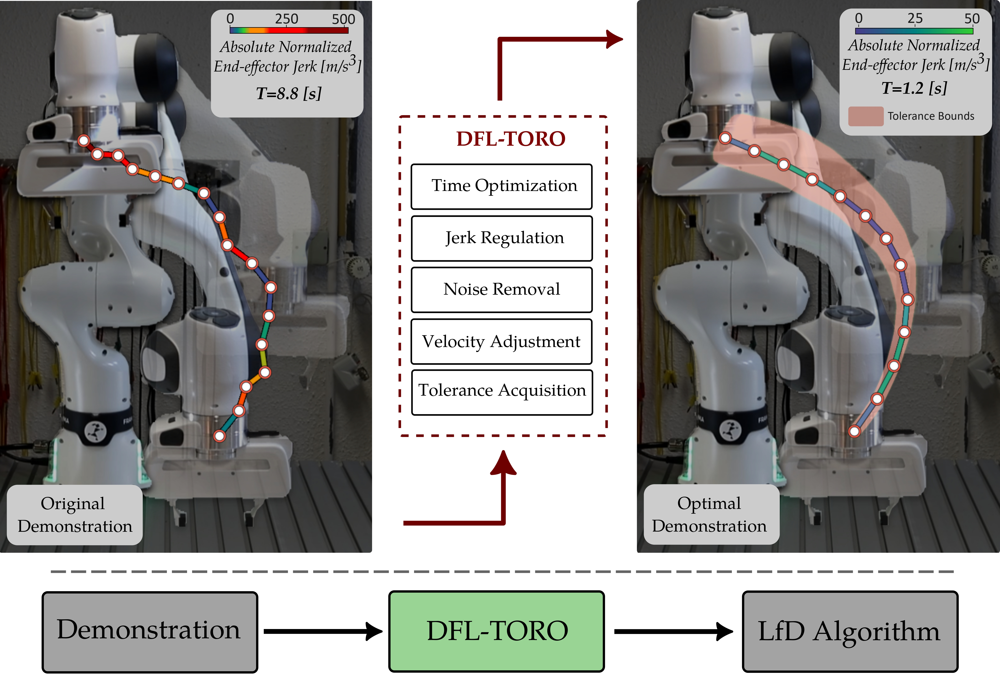
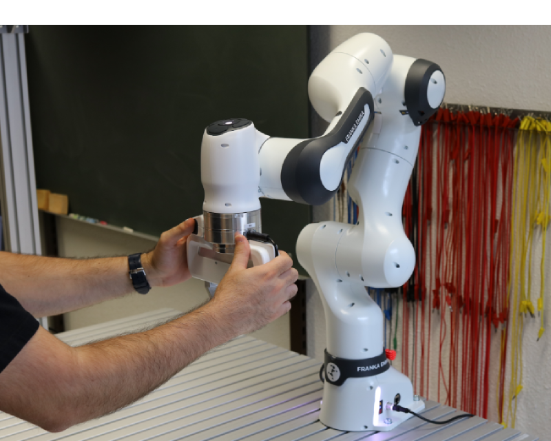
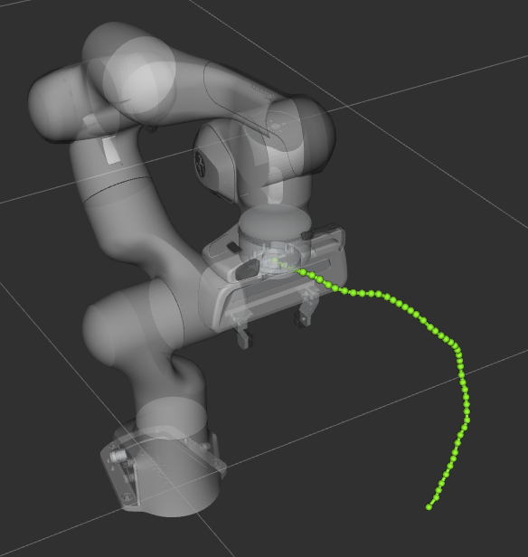
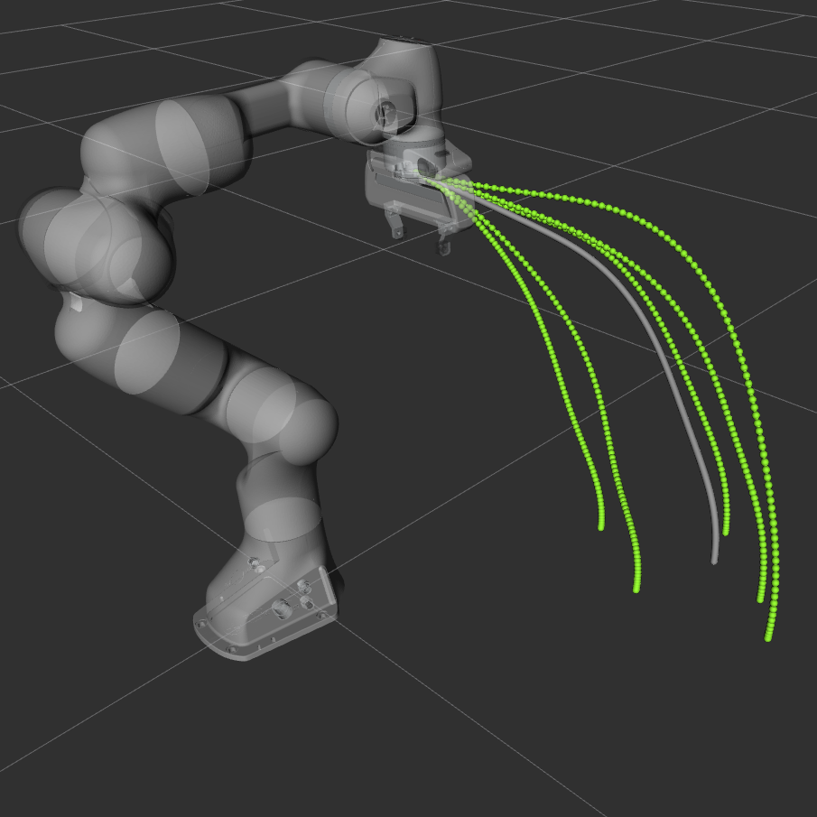

<div align="center">
 <h1>DFL-TORO: A One-Shot Demonstration Framework for Learning Time-Optimal Robotic Manufacturing Tasks</h1>
</div>

**DFL-TORO** is a one-shot demonstration framework for learning time-optimal robotic manufacturing tasks. It optimizes Learning from Demonstration (LfD) by minimizing the need for multiple demonstrations, resulting in efficient, noise-free, and jerk-regulated trajectories. Designed for intuitive kinesthetic demonstrations, DFL-TORO enhances robotic programming efficiency and precision in tasks such as pick-and-place. Evaluations with robots like the Franka Emika Research 3 (FR3) and ABB YuMi demonstrate its effectiveness in transforming demonstrations into optimized, high-performance manufacturing solutions. (Video: https://youtu.be/YJc6DwTqz8o?si=LqTFP7WXPNOFhYCM)


<p align="center">
  <a href="">
    
  </a>
</p>


## Table of Contents

- [Modules and Packages](#modules)
   - [Principal Modules](#principal-modules)
   - [FR3 Modules](#fr3-modules)
   - [ABB Yumi Modules](#abb-modules)
- [Installation Guide](#installation)
   - [Docker Installation](#docker)
   - [Building from Source](#source)
- [Usage Guide](#usage)
   - [Record a Demonstration](#record)
   - [Optimize a Demonstration](#optimize)
   - [Learning from a Demonstration](#learn)
   - [Crafting LfD Programs with High-Level Instructions](#program)
- [Notes](#notes)
   - [License](#license)
   - [Contributions](#contributions)
   - [Acknowledgements](#acknowledgments)
   - [Maintainers](#maintainers)

## Modules and Packages <a id="modules"></a>

### Principal Modules <a id="principal-modules"></a>
The principal modules comprising DFL-TORO are briefly described in the following table:

| Module | Description |
| --- | --- |
| [lfd_interface](https://github.com/snt-arg/lfd_interface) | The LFD Interface module is the core element of DFL-TORO. This module is responsible for providing an interface to various modules of the software and allowing interaction of the user with different functionalities of the software. The main design objective in developing this module was to provide a standard interface to enhance the extensibility and modularity of the framework.  |
| [lfd_smoothing](https://github.com/snt-arg/lfd_smoothing) | The main role of the this module is to take raw recorded demonstrations and convert them into optimal demonstration trajectories. |
| [lfd_dmp](https://github.com/snt-arg/lfd_dmp) | This module is the implementation of DMPs, which is responsible for training demonstrations and planning trajectories based on the required start and goal configuration. |

Besides the principal packages, several other packages are included to enable implementation on Franka Research 3 (FR3) and ABB Dual-Arm YuMi.

### FR3 Modules <a id="fr3-modules"></a>

| Module | Description |
| --- | --- |
| [franka_ws](https://github.com/snt-arg/franka_ws) | Launch files and required config to run different controllers on FR3.  |
| [fr3_moveit_config](https://github.com/snt-arg/fr3_moveit_config) | Moveit configuration package for FR3. |
| [franka_drake](https://github.com/snt-arg/franka_drake) | Description package to enable using FR3 model in PyDrake. |


### ABB YuMi Modules <a id="abb-modules"></a>

| Module | Description |
| --- | --- |
| [yumi_bringup](https://github.com/snt-arg/yumi_bringup) | Source files and scripts required to control ABB Yumi via the [ABB Robot Driver](https://github.com/ros-industrial/abb_robot_driver)   |
| [yumi_moveit_config](https://github.com/snt-arg/yumi_moveit_config) | Moveit configuration package for ABB Yumi. |
| [yumi_drake](https://github.com/snt-arg/yumi_drake) | Description package to enable using Yumi model in [PyDrake](https://drake.mit.edu/). |


## Installation Guide <a id="installation"></a>


### Docker Installation <a id="docker"></a>

#### Prerequisites

- Linux distribution
- Docker and Docker Compose installed
- vcs tools

#### Installation Steps

1. **Clone the Repository**
   
   Begin by cloning the repository and navigating to the project directory:
   
   ```bash
   git clone https://github.com/snt-arg/dfl-toro.git
   cd dfl-toro
   ```

2. **Import Required Repositories**

   Import the required repositories into a mount folder using the following commands:
   
   ```bash
   mkdir -p _ws/src
   vcs import --recursive _ws/src < .rosinstall_dfl_toro
   # In case of using FR3 robot
   vcs import --recursive _ws/src < .rosinstall_franka
   # In case of using ABB Yumi
   vcs import --recursive _ws/src < .rosinstall_abb_yumi
   ```
   

3. **Run the Docker Container**

   Move to the Docker configuration directory and start the container:
   
   ```bash
   cd docker/compose
   docker compose up
   ```

4. **Access the Docker Container**

   Once the container is running, access it via the following command:
   
   ```bash
   docker exec -it ros_noetic bash
   cd ~/main_ws/
   ```

### Building from Source <a id="source"></a>

#### Prerequisites

- ROS Noetic (Tested only on Ubuntu 20.04)
- Moveit1
- CMake
- vcs tools

#### Installation Steps

1. **Install System Dependencies**

   Ensure your system is up to date and install the necessary dependencies:
   
   ```bash
   sudo apt-get update && sudo apt-get install -y \
         python3-vcstool \
         ros-noetic-ros-control \
         ros-noetic-ros-controllers \
         ros-noetic-actionlib-tools
   ```

2. **Clone the Repository**

   Clone the repository and navigate to the project directory:
   
   ```bash
   git clone https://github.com/snt-arg/dfl-toro.git
   cd dfl-toro
   ```

3. **Install Python Dependencies**

   Install all the required Python packages listed in the requirements file:
   
   ```bash
   pip install -r requirements.txt
   ```

4. **Import Required Repositories**

   Use vcs to import the required repositories:
   
   ```bash
   vcs import --recursive $YOUR_CATKIN_WS_DIR$/src < .rosinstall_dfl_toro
   # In case of using FR3 robot
   vcs import --recursive $YOUR_CATKIN_WS_DIR$/src < .rosinstall_franka
   # In case of using ABB Yumi
   vcs import --recursive $YOUR_CATKIN_WS_DIR$/src < .rosinstall_abb_yumi
   ```

5. **Install Package Dependencies**

   Install dependencies for the ROS packages:
   
   ```bash
   cd $YOUR_CATKIN_WS_DIR$
   rosdep init && rosdep update --include-eol-distros
   rosdep install --from-paths src --ignore-src --rosdistro noetic
   ```

6. **Build the Packages**

   Build the packages using the `catkin` command:
   
   ```bash
   catkin build
   ```


## Usage Guide <a id="usage"></a>

This tutorial is designed for the Franka Research 3 (FR3) robotic arm, utilizing a learning approach based on Dynamic Movement Primitives (DMP). Before proceeding, please create the following folder structure within the `lfd_interface` package to organize the necessary data:

```plaintext
<lfd_interface>/
├── data                     
    ├── demonstrations 
    └── smoother
        ├── timing
        ├── waypoints
        └── traj
```

A video demonstration for a pick and place task is available here: https://youtu.be/wddDjkp_Z2U?si=evYXkvJCtPFPYrp-

### Record a Demonstration <a id="record"></a>

To record a demonstration, use the following command:

```bash
roslaunch lfd_interface lfd_recorder.launch config:=fr3 name:=DEMO_NAME
```

**Note:** The demonstration name must not contain numbers or special characters such as underscores.

- When recording starts, the recorder will automatically ignore the initial part of the recording where the robot is stationary and has not yet moved (i.e., before the demonstration begins).
- During the recording, the recorded path will be visualized in real-time using RViz.

To stop the recording, press `Ctrl+C`. The demonstration will be saved under `lfd_interface/data/demonstrations/`.

<div style="display: flex; gap: 10%;">
  
  
</div>

#### What is Recorded

The recorded data includes the joint states, their timings, and the end-effector pose throughout the demonstration, with a specified recording frequency.

#### Configuration

The configuration file is located at `lfd_interface/config/demonstrations`. The configuration file for FR3 looks like this:

```yaml
robot_ns: "fr3"
planning_group: "fr3_arm"
base_frame: "fr3_link0"
ee_frame: "fr3_hand_tcp"
```

- **robot_ns**: Specifies the robot's namespace used for topics and services.
- **planning_group**: Defines the MoveIt planning group to be used during the demonstration.
- **base_frame**: The name of the link in the robot's URDF file that serves as the base frame.
- **ee_frame**: The name of the link in the robot's URDF file that serves as the end-effector frame, used for recording the end-effector pose throughout the demonstration.


### Optimize a Demonstration <a id="optimize"></a>

The optimization process refines the original demonstration trajectory to produce a noise-free, smooth, and efficient trajectory.

```bash
roslaunch lfd_smoothing trajectory_smoothing.launch demo_name:=DEMO_NAME robot_type:=fr3
```

The optimization occurs in two stages. At the end of each stage, a plot of the resulting trajectory will be displayed. Close the first plot to proceed to the second stage. The optimized demonstration will be saved with the prefix "smooth" (e.g., if the original demonstration is named "pick", the optimized version will be named "smoothpick").

The result can be visualized through Drake's MeshCat, accessible by default at `localhost:7000`.

#### Configuration

The configuration file for optimization is located in `lfd_smoothing/config`. The general configuration file for FR3 looks like this:

```yaml
smoother_config: {
  demo_filter_threshold: 0.01,
  pkg_xml: $(find lfd_smoothing)/drake/franka_drake/package.xml,
  urdf_path: package://franka_drake/urdf/fr3_nohand.urdf,
  config_hierarchy: ["$(find lfd_smoothing)/config/opt/initial.yaml", "$(find lfd_smoothing)/config/opt/main.yaml"],
  robot_type: "fr3"
}

ik_solver_config: {
  pkg_xml: $(find lfd_smoothing)/drake/franka_drake/package.xml,
  urdf_path: package://franka_drake/urdf/fr3_full.urdf,
  ee_frame: fr3_hand_tcp,
  robot_type: "fr3"
}
```

- **demo_filter_threshold**: Determines the minimum distance between waypoints extracted from the original path. A higher value reduces the number of waypoints, leading to faster optimization.
- **pkg_xml** and **urdf_path**: Paths for the robot's URDF packages, used by Drake to model and visualize the robot.
- **config_hierarchy**: Paths to configuration files for the two stages of optimization.
- **ee_frame**: End-effector frame used for the IK solver.

#### Optimization Stages

The configuration files for each stage of the optimization are in `lfd_smoothing/config/opt`.

##### First Optimization Stage Configuration (FR3)

```yaml
num_cps: 4
bspline_order: 4
wp_per_segment: 2
overlap: 1
velocity_scaling: 1
duration_bound: [0.01, 5]
coeff_duration: 1
tol_joint: 0
solver_log: "/tmp/trajopt1.txt"
plot: true
```

- **num_cps**: Number of control points per path segment.
- **bspline_order**: Order of the B-spline used for trajectory modeling.
- **wp_per_segment**: Number of waypoints per trajectory segment.
- **overlap**: Number of waypoints overlapping between adjacent segments.
- **velocity_scaling**: Scaling factor for velocity limits (default is 1).
- **duration_bound**: Minimum and maximum duration bounds for the trajectory.
- **coeff_duration**: Coefficient for the duration term in the cost function.
- **tol_joint**: Tolerance for deviation from the original joint configuration.
- **solver_log**: Path for solver logs.
- **plot**: Whether to display the optimization result.

##### Second Optimization Stage Configuration (FR3)

```yaml
bspline_order: 4
velocity_scaling: 1
acceleration_scaling: 1
jerk_scaling: 1
duration_bound: [0.01, 5]
coeff_duration: 1
coeff_jerk: 0.04
coeff_joint_cp_error: 1
tol_translation: 0.02
tol_rotation: 0.05
solver_log: "/tmp/trajopt2.txt"
plot: true
```

- **acceleration_scaling** and **jerk_scaling**: Similar to velocity scaling, used to adjust limits for acceleration and jerk.
- **coeff_jerk**: Coefficient for the jerk term in the cost function.
- **coeff_joint_cp_error**: Coefficient for penalizing deviations from the original joint configuration.
- **tol_translation**: Tolerance for end-effector translational deviation.
- **tol_rotation**: Tolerance for end-effector rotational deviation.

#### Tunable Parameters

Most configuration parameters are suitable for general use, but the following can be adjusted for specific demonstrations:

- **demo_filter_threshold**: Increasing this value allows for a smoother, faster trajectory by reducing the number of waypoints.
- **tol_translation** and **tol_rotation**: Adjust these values based on the required accuracy. Higher tolerances provide more freedom for smoother, faster optimization.


### Learning from a Demonstration <a id="learn"></a>

To initiate the learning from demonstration process, use the following command:

```bash
roslaunch lfd_interface program_bundle.launch robot_group:=fr3
```

This command launches several components, including the IK solver server, the MoveIt utility node, and the DMP server, to perform the LfD process.

#### Available Topics and Actions

The launched system exposes the following topics and actions:

- **`fr3/lfd_pipeline` Action Server**: Allows training on a specific demonstration and planning an LfD for a new goal configuration with a defined duration scale. It also provides options to visualize the resulting plan in RViz or directly execute it on the robot.

- **`fr3/plan_joint` and `fr3/plan_pose` Action Servers**: These servers use MoveIt's internal motion planning to plan and execute trajectories to reach a specified joint configuration or end-effector pose. The `fr3/plan_pose` server also requires an initial joint configuration for inverse kinematics (IK), considering null space in the case of redundant manipulators.

- **`fr3/pose_state` Topic**: Publishes the pose of the end-effector, similar to how the `joint_states` topic publishes joint positions.

The topics and actions provided allow for flexibility in LfD, including planning, visualization, and real-time execution, facilitating effective robot programming through demonstrations.


<p align="center">
  <a href="">
    
  </a>
</p>


### Crafting LfD Programs with High-Level Instructions <a id="program"></a>

To create complete programs from demonstrated subtasks, high-level instructions can be used to combine LfD-based subtasks into comprehensive robotic tasks.

#### Example: Pick and Place Task

Below is an example Python script that demonstrates how to craft an LfD program for a pick-and-place task using high-level instructions:

```python
import rospy
from lfd_program.runner import ProgramRunner

if __name__ == "__main__":

    rospy.init_node("lfd_program", anonymous=True)

    # Initialize the program
    runner = ProgramRunner(robot="fr3")
    runner.set_motion_mode("dmp")
    runner.configure_motion(duration_scale=DURATION_SCALE)
    runner.set_camera()  # If a camera program is set up

    # Picking LfD subtask
    runner.configure_motion(demo_name="PICK_DEMO_NAME")
    runner.move(debug=True)
    runner.locate_target("object_alias")  # If a camera program is set up and the object alias is defined
    runner.gripper.gripper_grasp()

    # Placing LfD subtask
    runner.configure_motion(demo_name="PLACE_DEMO_NAME")
    runner.move(debug=True)
    runner.gripper.gripper_open()
```

#### Debug Mode

If debug mode is activated, the planned LfD trajectory is first visualized in RViz before being executed on the robot. This helps verify the planned motion to ensure it meets the desired outcome.

## Notes <a id="notes"></a>

Please be aware that the included packages are intended for academic use and have not undergone productization. They are provided "as-is," with only limited support available.

### License <a id="license"></a>

This project is licensed under the SnT Academic License- see the [LICENSE](LICENSE) for more details.

### Contributions <a id="contributions"></a>

Contributions are welcome! If you have any suggestions, bug reports, or feature requests,
please create a new issue or pull request.

### Acknowledgements <a id="acknowledgments"></a>

This work was supported by the Luxembourg National Research Fund (FNR) through the Project ‘‘A Combined Machine Learning
Approach for the Engineering of Flexible Assembly Processes Using Collaborative Robots (ML-COBOTS)’’ under Grant 15882013.

If you use this framework in your scientific research, we would appreciate if you cite the corresponding paper:
```
@article{barekatain2024dfl,
  title={Dfl-toro: A one-shot demonstration framework for learning time-optimal robotic manufacturing tasks},
  author={Barekatain, Alireza and Habibi, Hamed and Voos, Holger},
  journal={IEEE Access},
  year={2024},
  publisher={IEEE}
}
```

### Maintainers <a id="maintainers"></a>

- [Alireza Barekatain](https://www.github.com/abarekatain)